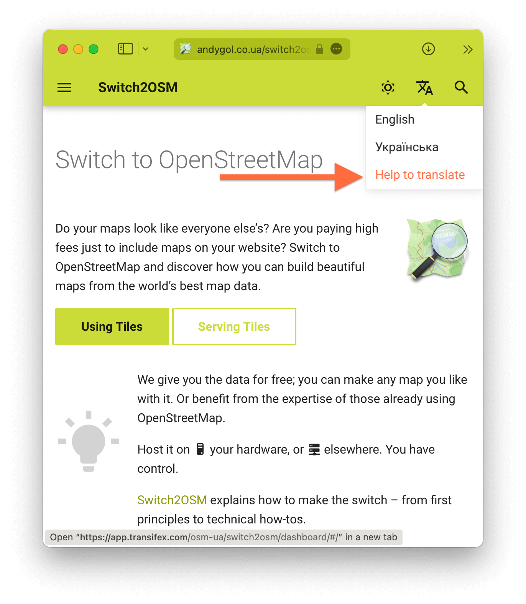

# Switch2OSM

This repository is the content for switch2osm.org.

See the issues for things to work on.

## Content principles ##

* Covers from first principles to technical how-tos.

  It's easy to be focused on technical guides (setting up a rendering server), but most users are more interested in how to switch their very small website from Google, so care more about how the monolithic Google Maps "API" is replaced by multiple components, and how to set up their webpage to use a free tile service.

* Avoids lock-in with specific vendors or services
* Does not require specific external services, aside from OpenStreetMap itself

  We do not promote anything which can result in lock-in to a specific vendor, so guides need to be usable without relying on a third party. It's okay to use something as an example (e.g. tile.osm.org) where there are plenty of alternatives, but not if there are few alternatives or the service being used cannot be reproduced.

  Exceptions are
  * planet.openstreetmap.org, for OSM data itself
  * openstreetmapdata.com, for coastlines and other preprocessed data
  * Natural Earth and other well-used public data sources

## Content technical needs ##

* Uses multiple steps to build understanding, rather than one shell script

  A single script which completes a long series of tasks can be useful, but builds no understanding of what is being done. As soon as someone wants to change the slightest aspect, they find they haven't gained any knowledge. These scripts also tend to be fragile.

* Does not present bad practices, even in a demo

  People will copy/paste short demos. Don't use bad practices that work just because the demo is simple.

* Avoids building from source

  Building from source adds significant complications while helping little with understanding.

* Avoids binary blobs that cannot be reproduced

  The instructions should be able to be adapted to other OSes or distributions. This means that the user should be able to build from source if they need to. OS packaging systems and PPAs meet this.

* Uses forwards-compatible portable instructions

  This is hard to do, but instructions should be crafted to work in the future, and to the extent possible, on future distributions. e.g. use output of config programs rather than hardcoding paths.

* Uses OS distribution methods for software when possible

  Use `apt` or `homebrew` or similar.

* Avoid using PPAs where possible.

  PPAs can be useful for grouping more different versions of software together, beyond what is distributed by the base OS, but they tend not to be supported forever, and aren't automatically tested for compatibility as new OS versions come out.  Also, base OS support of the components used here is much better than it was.

## Contribute

This is a re-work of original <https://switch2osm.org> website using [Material for MkDocs](https://squidfunk.github.io/mkdocs-material/).

The goal is to have instructions in different languages in one place.

You are welcome to extend the styling and content, add new languages. To do this, clone this repository, install the necessary dependencies and experiment.

```
git clone git@github.com:switch2osm/switch2osm.git
cd switch2osm
python -m venv venv
source ./venv/bin/activate
pip install -r requirements.txt
mkdocs serve
```

Open <http://127.0.0.1:8000/switch2osm/> in your browser.

## Translation



<!-- Translation into other languages is carried out on [Transifex](https://app.transifex.com/osm-ua/switch2osm/dashboard/). Click "Help to translate" in the language switcher to get there. -->

To add a translation in your language, follow these steps:

1. Begin by editing the `mkdocs.yml` file, which can be found at the root of the repository. To see an example of how to do this, refer to how the Ukrainian translation is added. Once completed, your language will be included in the language switcher, and all menu items and prompts will be displayed in your language.

2. Next, you can start translating the articles' text. Here's how:

   a. Duplicate the `en` folder and replace its name with your language code. Maintain the file names unchanged.

   b. Translate the values of the front matter keys in each Markdown file within your language folder.

   c. In each Markdown file, set the `lang` key in the front matter to match your language code, which should be the same as the name of your language folder.

   d. Preserve the Markdown formatting as is; there's no need to alter it.

3. If you have the `mkdocs serve` script running while making changes, the translated content will be automatically reflected in the displayed content after saving.

By following these steps, you can contribute translations to the project, making it accessible to a broader audience in your language.

## Copyright

© 2013–2023 OpenStreetMap and contributors, [CC BY-SA](http://creativecommons.org/licenses/by-sa/2.0/).