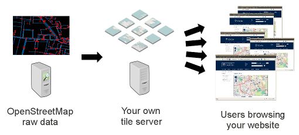

Tiles from a third-party provider are the simplest way to make the switch to OpenStreetMap, and offer clarity of cost. However, if you’d like to take full control of your destiny, you can render and serve your own tiles. This section explains how.

# Is it for you?

Both generating and serving tiles incur significant hardware requirements, especially if you need global coverage and regular updates.

If you are setting up your own tile server, we recommend that you use [Ubuntu Linux](https://ubuntu.com/).

# The options

1. Install locally on [Ubuntu 20.04](manually-building-a-tile-server-20-04-lts/), [Ubuntu 18.04](manually-building-a-tile-server-18-04-lts/) or [Ubuntu 16.04](manually-building-a-tile-server-16-04-lts/).

2. Use [docker](using-a-docker-container/).

# System requirements
Serving your own maps is a fairly intensive task. Depending on the size of the area you’re interested in serving and the traffic you expect the system requirements will vary. In general, requirements will range from 10-20GB of storage, 4GB of memory, and a modern dual-core processor for a city-sized region to 300GB+ of fast storage, 24GB of memory, and a quad-core processor for the entire planet.

We would recommend that you begin with extracts of OpenStreetMap data – for example, a city, county or small country – rather than spending a week importing the whole world (planet.osm) and then having to restart because of a configuration mistake! You can download extracts from:

* [Geofabrik](https://download.geofabrik.de/) (countries and provinces)
* [Protomaps Extracts](https://protomaps.com/extracts) (minutely-updated cities and small countries)
* [download.openstreetmap.fr](https://download.openstreetmap.fr/)

# The toolchain

We use a series of tools for generating and serving map tiles.

**Apache** provides the front end server that handles requests from your web browser and passes the request to mod_tile. The Apache web server can also be used to serve static web content like the HTML, JavaScript, or CSS for your map webpage.

Once Apache handles the request from the web user, it passes the request to mod_tile to deal with. Mod_tile checks if the tile has already been created and is ready for use or whether it needs to be updated due to not being in the cache already. If it is already available and doesn’t need to be rendered, then it immediately sends the tile back to the client. If it does need to be rendered, then it will add it to a “render request” queue, and when it gets to the top of the queue, a tile renderer will render it and send the tile back to the client.

We use a tool called **Mapnik** to render tiles. It pulls requests from the work queue as fast as possible, extracts data from various data sources according to the style information, and renders the tile. This tile is passed back to the client and moves on to the next item in the queue.

For rendering, OpenStreetMap data is stored in a **PostgreSQL** database created by a tool called **osm2pgsql**. These two pieces work together to allow efficient access to the OpenStreetMap geographic data. It is possible to keep the data in the PostgreSQL database up to date using a stream of diff files produced every 60 seconds on the main OpenStreetMap server.
